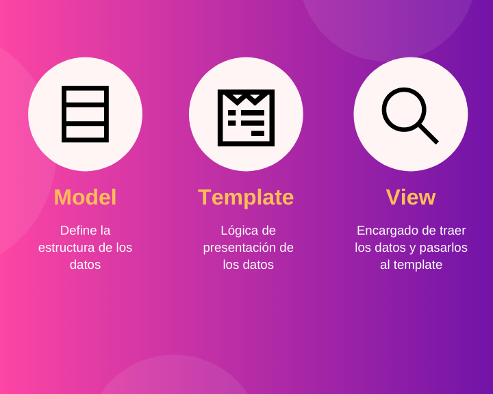

# Aplicaciones, templates y patrones de diseño
Para crear una app usamos el manage.py de la siguente forma
```
$ python manage.py startapp nombre_app
```
##### Trata de que el nombre siempre esté en plural

## Carpetas y archivos generados con la app

 - __init__.py: diciendo que esto es un módulo de python, siempre vacio
 -  admin.py: se encarga de registrar los modelos en el admin de django
 - apps.py: declara la configuración de la app para el público para hacerla más reutilizables
 - models.py: para definir los modelos de los datos de
 - test.py para pruebase
 - views.py:  para las vistas


 - **Carpeta migrations Se encarga de grabar los cambios en la DB**

## Template System

El Template System es una manera de mostrar los datos usando HTML, incluye un poco de logica de programación que permite más flexibilidad en la UI, se declaran dentro de la variable TEMPLATES en settings.py

## Patrones de Diseño de Django

Trata de aproximarse a la arquitectura MVC (Model View Controller) con MTV (Model Template View) 


### Model
**_Es la forma en la que creamos esquemas de objetos_** (un usuario, un post, etc) para representarlos en nuestra base de datos. 

El modelo sin importar nuestro sistema ge BD (mysql, postgress, etc) nos ayudara a crear esta entidad a través de un OMR, esto nos ahorra la molestia de tener que escribir las sentencias de SQL para crear las tablas y atributos.
###### models.py: Modelos de la aplicación

### Template
**_Es el encargado de manejar la lógica y sintaxis de la información_** que se va a presentar en el cliente, el sistema de templates de django usa HTML para ello.
###### urls.py: maneja la parte de las rutas
###### views.py: maneja el request del usuario

### View
**_Su función es solo suministrar datos al template_**
###### hmtl: se renderiza a través del sistema de templates de Django
 
Manda la información necesaria el template para que este pueda manejar los datos y presentarlos de una manera correcta.