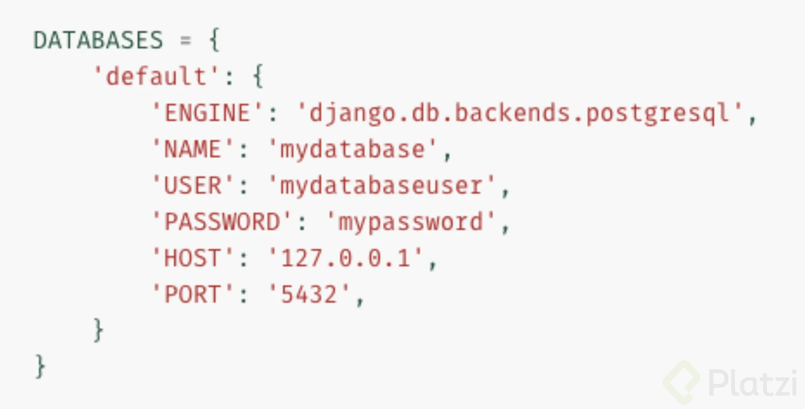

# ¿Cómo conectar Django a una base de datos?
Django obtiene la estructura, acceso y control de los datos de una aplicación a través de su ORM (Object Relational Mapper), esto significa que no importa qué motor de base de datos esté usando, el mismo código seguirá funcionando, configurar esto en un proyecto de Django es cuestión de segundos.

Todo se define dentro del archivo settings.py de nuestro proyecto dentro de la variable DATABASES:
### DATABASE
Será el nodo padre que nos servirá para indicar que definiremos una base de datos.
Dentro, tendremos el nodo default este tendrá toda la configuración clave de la base de datos.

Además, Django puede trabajar con múltiples bases de datos usando una estrategia llamada routers por lo que el diccionario DATABASES puede contener múltiples llaves con diferentes bases de datos. Pero eso sí, necesita siempre existir una llave “default”.

Es un diccionario de python el cual requiere definir una base de datos por default, más de eso al final, usando la llave default que a su vez será otro diccionario con los datos de configuración:

### La configuración recibirá el engine el cual puede ser:

- PostgreSQL: 'django.db.backends.postgresql’
- MySQL: 'django.db.backends.mysql’
- SQLite: 'django.db.backends.sqlite3’
- Oracle: 'Django.db.backends.oracle’
- El nombre de la base de datos “NAME”.
- El usuario “USER”.
- La contraseña “PASSWORD”.
- La ubicación o host del servidor de la base de datos “HOST”.
- Y el puerto de conexión “PORT”.

Adicionalmente, se pueden configurar más detalles por base de datos, por ejemplo, configurar que todos los queries de una vista sean empaquetados en una sola transacción a la base de datos usando ATOMIC_REQUESTS=True

